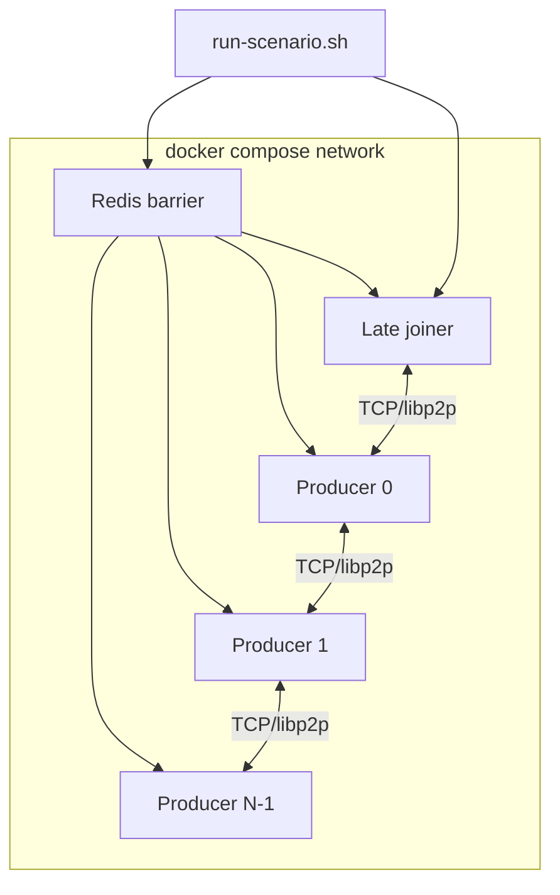

# Backlog items for DeChat repo

**Project:** DeChat (Decentralized Chat Application)  
**Component:** `@dechat/core` (P2P Networking & Replication Engine)  
**Audit Scope:** Distributed Systems Performance, Network Reliability, and Concurrency  
**Status:** Pending Review  

---

## Executive Summary
The core architecture has successfully transitioned to a robust, Dependency-Injection-driven modular system. Interfaces, strategies, and factories are strictly defined. The next phase of development must address edge cases inherent to decentralized distributed systems: preventing CPU/Memory bottlenecks during network storms, handling network partitions, and ensuring deterministic concurrency.

---

## P0 — Address first: Mesh identity vs room membership

> **Do this before further chat/UI work.** It is a correctness bug in how DeChat partitions meshes, not a room-ACL feature.

### Task 0.1: Unify `infoHash` / network ID as mesh partition (not a room join ticket)

* **Severity:** **Critical** (mesh isolation)
* **Status:** **Open — next**
* **Related:** [CONTEXT.md](CONTEXT.md) (Network ID, Open room, Verified peer); ADR-0005; `createDeChatNode`; `PeerAuthenticator`

#### Intended design (three different questions)

| Question | Mechanism | Not this |
|----------|-----------|----------|
| Is this a **DeChat** peer, or some other libp2p/IPFS node? | DeChat protocol strings (`/deChat/core/auth/1.0.0`, PEX, replication) + Ed25519 auth. Fail handshake → never enter `PeerRegistry`. | `infoHash` is unnecessary for this. |
| Which **DeChat mesh** is this (prod vs staging, two products, two testnets)? | **Network ID / `infoHash`.** Peers on different IDs must not authenticate, PEX, or replicate with each other. | Not a room password. |
| May this peer enter chat room `lobby`? | `joinRoom(roomId)` (open rooms: any **verified peer already on this mesh**, no invite). Later: capability rooms. | Not `infoHash`. Knowing the mesh ID is not a ticket into every room. |

`infoHash` exists so that in a vast shared P2P underlay we can tell “this node is on *our* DeChat network” versus another DeChat (or other) network that happens to speak similar stacks. Discovery + onboard + auth already reject non-DeChat peers. Room join is a separate application concern.

#### What the code does today (the bug)

`createNode(infoHash, nodeSeed, …)` / `createDeChatNode` uses `infoHash` **only** to set libp2p Identify `protocolPrefix` via `generateIdProtocolPrefix(infoHash)` (CRC-32 → 7-char base36). It does **not** flow into the rest of the mesh.

Meanwhile these stay **global defaults**, independent of `infoHash`:

| Knob | Default | Effect |
|------|---------|--------|
| `config.peerAuthenticator.networkId` | `'deChat-core-net-v1'` | Bound into the auth nonce. Two nodes with *different* `infoHash` still auth if both leave this default. |
| `pexService.pexTopic` / `pexProtocol` | `/deChat/core/peer-exchange-…` | PEX gossip is not mesh-scoped. |
| `strategies.replication.topic` / `protocol` | `/deChat/v1/topic/replication-protocol` etc. | Hash ANNOUNCE/REQUEST is not mesh-scoped. |
| Room GossipSub topics | `/deChat/v1/room/<roomId>` | Same `roomId` on two meshes would share a topic. |
| Anti-entropy protocol | `/deChat/v1/anti-entropy/1.0.0` | Same. |

Interop workers pass `networkId` as `createNode`’s first argument (so Identify prefixes differ) but typically **do not** set `peerAuthenticator.networkId`. Distinct `--net` flags therefore do **not** fully isolate leftover workers on the same host.

#### Why this is serious

1. **Two DeChat deployments on the same LAN / shared bootstrap** (different `infoHash` by intent) can still complete auth, PEX, and replicate — including **the same room topic** if room IDs collide. Mesh isolation is the whole point of `infoHash`; today it is incomplete.
2. **Docs / chat readiness** had started to say “anyone on the same `infoHash` may `joinRoom`.” That is the wrong layer. Open room = no invite among **verified peers**. Do not treat mesh ID as a room ACL (that mistake is corrected in CONTEXT; this task is the **code** fix).
3. **Two names, one idea, not wired:** glossary “Network ID (`infoHash`)” vs config `peerAuthenticator.networkId` vs `createNode`’s first argument. Callers (and interop) reasonably assume one knob; the implementation has two that diverge.

Non-DeChat libp2p peers are already excluded by protocol + auth. That part is fine. The hole is **DeChat-vs-DeChat mesh partition**.

#### Proposed direction (groom when implementing)

1. Treat **one canonical mesh id** (keep calling it Network ID / `infoHash` in the glossary). `createNode(infoHash, …)` must apply it to Identify **and** auth `networkId`, and namespace PEX / replication / room / anti-entropy protocol strings (or equivalent isolation that cannot cross-talk).
2. Do **not** use that id as `joinRoom` authorization. Open rooms stay: verified peer + explicit `joinRoom(roomId)`.
3. Tests: two in-process nodes with **different** `infoHash` on the same listen/bootstrap must **fail** auth (or never share PEX/replication/room topics). Two nodes with the **same** `infoHash` still form a mesh. Chat interop must keep using one mesh id and `joinRoom` for rooms.
4. Align `@dechat/chat` `CreateChatClientOptions.infoHash` with that single knob; README already states mesh vs room.

#### Acceptance criteria

- [ ] A single mesh id from `createNode` / `createChatClient` partitions Identify, auth, PEX, and replication (no cross-mesh gossip of hashes or room announces).
- [ ] Unit or interop test: different `infoHash` → no verified registry membership and no shared room/replication topic traffic.
- [ ] `joinRoom` still does not consult `infoHash`; open-room wording stays “verified peer,” not “knows the infoHash.”
- [ ] Interop `--net` / worker `networkId` actually isolates leftover workers.

#### Affected modules

`packages/core/src/createDeChatNode.ts`, `packages/core/src/config/defaults.ts` (`peerAuthenticator.networkId`, PEX, replication, anti-entropy protocol strings), `packages/core/src/networking/PeerAuthenticator.ts`, `packages/core/src/data-replication/room-scope/roomId.ts` (`roomTopic`), `packages/chat/src/createChatClient.ts`, interop `workerUitls.ts` / compose `NETWORK_ID`.

#### Estimated effort

~2–4 days including tests (namespacing protocol strings + one isolation interop).

---

## 🏎️ Category 1: Performance & CPU Optimizations

### Task 1.1: Replace JSON Serialization with Binary Formats — Completed (Phase 1)
* **Severity:** High
* **The Issue:** The `GenericDataSerializer` currently uses `JSON.stringify` and `JSON.parse`. `JSON.parse` is synchronous and blocks the Node.js event loop.
* **The Impact:** In a P2P network, nodes parse hundreds of messages per second during a broadcast storm. If a peer sends a large payload (e.g., 256KB), your node freezes while parsing it, causing latency spikes and dropping other concurrent TCP/WebRTC connections.
* **The Solution:** 1. Migrate the data serialization layer to a binary format.
  2. Implement **Protocol Buffers** (using `protobufjs` or `protons`) or **CBOR** (using `cbor-x`).
  3. Define strict schema boundaries for `PropagatedMessage` to ensure payload sizes are known and validated before allocation.
* **Affected Modules:** `src/data-replication/serializers.ts`, `GenericDataSerializer`
* **Completed (2026-06-28, PR #35):** Unified wire encoding behind `components.serializer` with CBOR default (`cbor-x`), config-driven JSON fallback, length-prefixed stream framing, and `ReplicationContent` as `Uint8Array`. All propagation, replication, PEX, and auth paths use DI. `canonicalSerialize` unchanged for content hashing. Protobuf envelopes and strict pre-allocation schemas deferred to Phase 2.

### Task 1.2: Optimize Kademlia XOR Distance Hot-Path
* **Severity:** Medium
* **The Issue:** In `KReplicaContentHashReplication.shouldReplicate`, the node calculates `calculateXorDistance(peer, content)` for *every single known peer* upon receiving *every single incoming message*.
* **The Impact:** `BigInt` instantiation and mathematical comparisons in a high-frequency loop cause extreme CPU churn and trigger aggressive Garbage Collection (GC) pauses.
* **The Solution:** 1. Implement a caching mechanism (e.g., `LRUCache`) for XOR distances. 
  2. Alternatively, pre-calculate distances when a new peer joins the `PeerRegistry`, rather than re-calculating the entire network view dynamically on every message.
* **Affected Modules:** `src/data-replication/KReplicaContentHashReplication.ts`, `shouldReplicate()`

---

## 🛡️ Category 2: Network Reliability & Robustness

### Task 2.1: Implement Background Anti-Entropy Sync (Split-Brain Recovery) - Data convergence - Completed
* **Severity:** High (Critical for Data Consistency)
* **The Issue:** The current `KReplica` strategy is *reactive* (replicating data as it arrives via pubsub). If the network suffers a temporary partition (Split-Brain), nodes on Side A will miss all gossip events from Side B.
* **The Impact:** When the partition heals, nodes will have diverging databases and missing messages, permanently breaking the chat history.
* **The Solution:** 1. Implement a background Anti-Entropy protocol.
  2. Every `X` minutes, nodes should randomly select a peer and exchange a lightweight summary of their database.
  3. Use **Merkle DAGs**, **Vector Clocks**, or **Bloom Filters of stored hashes** to efficiently determine which hashes are missing.
  4. Silently fetch the missing messages via the DHT/Direct Streams.
* **Affected Modules:** `src/data-replication/`, new Anti-Entropy strategy needed.

### Task 2.2: Implement Bloom Filter Rotation in Peer Exchange (PEX)
* **Severity:** Medium
* **The Issue:** PEX uses a Bloom Filter with a 24-hour TTL (`seenPeersBloomFilterTTLMs`) to prevent sending duplicate peer addresses in gossip.
* **The Impact:** Bloom filters suffer from "saturation." As the filter fills up over 24 hours, its false-positive rate spikes. Eventually, the node will stop gossiping peers altogether because it falsely assumes it has already shared everyone.
* **The Solution:** 1. Implement a "Double Filter" (Current and Previous) rotation strategy.
  2. Keep two filters. Every 12 hours, drop the Previous filter, shift the Current filter to Previous, and instantiate a fresh Current filter.
  3. Check both filters before gossiping, but only add new peers to the Current filter.
* **Affected Modules:** `src/networking/PeerExchangeService.ts`

### Task 2.3: Improve Connection Manager using Libp2p version 3.X
* **Severity:** Medium
* **The Issue:** Current core package uses libp2p 2.x.x version and it does not support min_connections config. 
* **The Impact:** Although we have our own min connection strategy implemented by dial queue it will be better to use the libp2p's support for min conneciton as it will be well battle tested. Can make our node more robust.
* **The Solution:** Come up with better Connection Manager strategy (Maintaining min and max connections for each peer) Latest Libp2p version 3.x.x has support for autoDial and minConnections in the connection Manager config check that out.
* **Affected Modules:** `src/networking/DialQueue.ts` `src/node.ts`

---

## 🚦 Category 3: Stream & Concurrency Management

### Task 3.1: Enforce Direct Stream Backpressure & Timeouts
* **Severity:** High (Security / DoS vector)
* **The Issue:** `DirectStreamPropagation` dials peers and writes raw data to streams without explicit time-bounding.
* **The Impact:** A malicious or extremely slow peer (e.g., 50 kbps) can cause your node's outbound buffers to bloat. If you attempt to send a 5MB buffer and the peer reads it at a crawl, that memory sits in your node's RAM. Multiplied by 100 peers, this causes an Out-of-Memory (OOM) crash (Slowloris attack).
* **The Solution:** 1. Wrap `writeToStream` calls with an `AbortController`.
  2. If the stream doesn't flush within a reasonable timeout (e.g., 5 seconds), abort the stream and penalize the peer using `PeerScorer`.
* **Affected Modules:** `src/data-propagation/direct/DirectStreamPropagation.ts`, `src/utils.ts`

### Task 3.2: Prevent Broadcast Halts (`Promise.all` Vulnerability)
* **Severity:** Medium
* **The Issue:** Using `Promise.all()` to fan out network requests to multiple peers.
* **The Impact:** `Promise.all` fails fast. If you are broadcasting to 5 peers and the 1st peer drops the connection (throwing an error), the Promise rejects immediately, and the remaining 4 peers might not get the message or the execution context halts.
* **The Solution:** 1. Audit the codebase for network loops utilizing `Promise.all`.
  2. Replace with `Promise.allSettled()`.
  3. Log the rejected promises individually without breaking the overall fan-out logic.
* **Affected Modules:** `ReplicationMessageProtocolManager.ts`, `PeerExchangeService.ts`

---

## 🔒 Category 4: Security & Future-Proofing

### Task 4.1: Implement End-to-End Encryption (E2EE)
* **Severity:** High (For Application Layer)
* **The Issue:** Libp2p encrypts the *transport* layer (Noise/TLS), meaning ISPs cannot read the traffic. However, middle-man nodes routing the gossip messages *can* read the payload at rest.
* **The Impact:** Zero privacy in a decentralized network; any node replicating the chat data can parse the message contents.
* **The Solution:** 1. Generate asymmetric application keys for users (distinct from Libp2p Network Identity keys).
  2. Encrypt the inner application payload *before* passing it to `GenericDataSerializer`.
  3. The `core` network layer should only route opaque ciphertext blobs identified by a `ContentHash`. 
* **Affected Modules:** App-layer integration (outside of `core`, but `core` must treat payloads as strictly opaque `Uint8Array`s).

---

## 🧪 Category 5: Adaptive Anti-Entropy — Scale Testing & Realistic Network Simulation

**Context:** Adaptive anti-entropy scheduling shipped in PR [#36](https://github.com/Ahmed-Abdul-Rahman/de-chat/pull/36) (ADR [0003](docs/adr/0003-adaptive-anti-entropy-scheduling.md)). CI validates correctness via worker-thread interop (`packages/core/tests/interop/`). [Testground](https://github.com/testground/testground) was evaluated and **deferred** — libp2p moved to Docker Compose for the same class of problems ([rationale](https://github.com/libp2p/test-plans/issues/103)). This category implements a **two-tier** scale-testing strategy instead.

**Prior art / references:**
- Current interop harness: `InterOpScenarios.ts`, `interOpTestRunner.dataSync.int.ts`, `nodeWorker.ts`, `nodeWorkerData.ts`
- Dormant-room scheduling bench: `packages/core/tests/perf/antiEntropyScheduler.bench.ts` (`yarn workspace @dechat/core bench:anti-entropy`)
- libp2p Compose pattern: [libp2p/test-plans#103](https://github.com/libp2p/test-plans/issues/103), [libp2p/unified-testing](https://github.com/libp2p/unified-testing)

---

### Task 5.1: Tier 1 — Extend In-Process Interop (Worker-Thread Harness)

> **Implementation plan:** [tasks/tier1-adaptive-interop.md](tasks/tier1-adaptive-interop.md) — groomed checklist, CI strategy, phased PRs.

* **Severity:** Medium (confidence / regression prevention for adaptive scheduler)
* **Status:** **Completed** (2026-07-16) — [PR #37](https://github.com/Ahmed-Abdul-Rahman/de-chat/pull/37) + consecutive nightly greens; Bandit [PR #39](https://github.com/Ahmed-Abdul-Rahman/de-chat/pull/39) merged
* **Depends on:** Task 2.1 adaptive scheduling (PR #36) — **done**
* **Goal:** Increase statistical confidence in adaptive anti-entropy behaviour **without** new infrastructure. Build on the existing single-host worker-thread interop that already runs in CI.

#### Resolved (PR #37)

| Item | Resolution |
|------|------------|
| Adaptive test waits | Strict `hasTargetData` polling when `ADAPTIVE_INTEROP_STRICT=true` |
| CI env | `ADAPTIVE_INTEROP_STRICT=true` on data-sync job in `ci.yaml` |
| Metrics in reports | `summarizeAntiEntropyMetrics` + anti-entropy section in interop reports |
| Scale | Nightly matrix 12/24/50 via `interop-scale-nightly.yml` |
| A/B comparison | `simulateAntiEntropyConvergenceAbComparison` + nightly A/B runner |
| Node parametrization | `interOpTestRunner.adaptiveScale.int.ts` + `--nodes` CLI |

#### Deliverables (all implemented in PR #37)

1. **Enable strict metric polling for adaptive scenario in CI**
   - Set `ADAPTIVE_INTEROP_STRICT=true` for the adaptive interop test job only (or entire `test:int:data-sync` once stable).
   - `pollLateJoinerConvergence` in `InterOpScenarios.ts` already polls `antiEntropy.usefulSyncs` every 2s — use this instead of `ANTI_ENTROPY_WAIT_MS` sleep for the adaptive test.
   - Keep sleep fallback when `ADAPTIVE_INTEROP_STRICT=false` for local debugging / transitional stability.

2. **Enrich worker snapshot + interop report**
   - Extend `WorkerResult.antiEntropy` snapshot in `nodeWorkerData.ts` with fields already available in `AntiEntropyMetricsStore`:
     - `floorSyncForces` (`skipCounts.floor_sync_forced`)
     - `scheduledTicks` (`scheduledTickStarted` counter)
     - `convergenceMs` (time from late-joiner spawn to first useful sync, measured in worker)
   - Update `generateTestReport` / `printTestReport` in `interopTestReporter.ts` to print adaptive metrics per node (at least late joiner + aggregate).
   - Optional: write JSON artifact to `packages/core/tests/interop/reports/` for nightly diffing.

3. **In-process A/B scenario: fixed vs heuristic**
   - New scenario (or parameterized variant of `simulateAntiEntropyConvergence`):
     - **Run A:** `adaptive.enabled: false`, `syncIntervalMs: 15_000`
     - **Run B:** `adaptive.enabled: true`, `scheduler: 'heuristic'`, same base interval bounds
   - Same topology: N−1 producers, 1 late joiner, same `expectedHashes`.
   - Assertions:
     - Both runs: `hasTargetData === true`, `replicaCount >= maxProducerReplicaCount`, `usefulSyncs > 0`
     - Run B (heuristic): `idleSkips > 0` on at least one producer after convergence phase (dormant room)
     - Run B wall time ≤ Run A wall time OR document acceptable trade-off in report (heuristic may be slower to converge but cheaper on wire — report both)
   - File: `interOpTestRunner.dataSync.int.ts` — mark as **nightly** initially if flaky at default CI timeouts.

4. **Parametrized scale runs (nightly, not PR gate)**
   - Add GitHub Actions workflow `interop-scale-nightly.yml` (or scheduled job on `develop`):
     - Adaptive late-joiner at `--nodes 12`, `--nodes 24`, `--nodes 50`
     - `NODE_OPTIONS: --max-old-space-size=6144` (match data-sync job)
     - Timeout: 60–90 min for 50-node run
   - Document commands in `packages/core/tests/interop/README.md` (create if missing).

5. **Port additional adaptive scenarios to strict polling**
   - `simulateSplitBrainConvergence`, `simulateOfflinePeerRevivalConvergence` — add optional `ADAPTIVE_INTEROP_STRICT` polling paths similar to late joiner (poll `usefulSyncs` / hash coverage instead of fixed sleep).

#### Files to touch

| File | Change |
|------|--------|
| `.github/workflows/ci.yaml` | `ADAPTIVE_INTEROP_STRICT=true` on data-sync job (or scoped step) |
| `.github/workflows/interop-scale-nightly.yml` | **New** — scheduled scale matrix |
| `packages/core/tests/interop/InterOpScenarios.ts` | A/B helper, strict polling for more scenarios |
| `packages/core/tests/interop/interOpTestRunner.dataSync.int.ts` | A/B test case, scale parametrization |
| `packages/core/tests/interop/childThread/nodeWorkerData.ts` | Extended `antiEntropy` snapshot |
| `packages/core/tests/interop/types.ts` | Extended `WorkerResult.antiEntropy` type |
| `packages/core/tests/interop/interopTestReporter.ts` | Report adaptive metrics |
| `packages/core/tests/interop/README.md` | **New** — env vars, nightly vs PR commands |

#### Acceptance criteria

- [x] PR CI (`test:int:data-sync`) passes with `ADAPTIVE_INTEROP_STRICT=true` ([PR #37](https://github.com/Ahmed-Abdul-Rahman/de-chat/pull/37))
- [x] Interop report prints `idleSkips`, `usefulSyncs`, `floorSyncForces` for late joiner
- [x] A/B scenario: both modes converge; heuristic shows `idleSkips > 0` on dormant producers (nightly)
- [x] Nightly 50-node adaptive run completes without worker-thread leak (post-merge soak)
- [x] No change to production `adaptive.enabled` default (`false`)

#### Out of scope (Tier 1)

- Real network latency / bandwidth simulation (Tier 2)
- Cross-container / multi-host deployment
- Testground or Kubernetes

---

### Task 5.2: Tier 2 — Docker Compose Interop (Real Network Isolation at Scale)

> **Implementation plan:** [tasks/tier2-compose-interop.md](tasks/tier2-compose-interop.md) — groomed checklist, phased PRs, approval gate.

* **Severity:** Medium–High (realistic P2P conditions; catches bugs invisible on localhost worker threads)
* **Status:** **Done (v1)** — PR A–D merged (#42–#45). Soak nightly on `develop`; promote Compose to PR gate only after 7 nights &lt; 5% flake.
* **Depends on:** Task 5.1 — **done**
* **Goal:** Run the same DeChat convergence scenarios in **isolated containers** with configurable network conditions (latency, jitter, bandwidth, partitions), following the pattern libp2p adopted after leaving Testground.

#### Why Tier 2 (not Testground)

| Need | Compose approach |
|------|------------------|
| 50–200 peers, real TCP between containers | `docker compose up --scale node=N` |
| Latency / jitter / loss | `tc netem` on container egress (documented, no Testground SDK) |
| Barriers / choreography | Stock Redis + existing scenario timing from `InterOpScenarios.ts` |
| Debuggability | `docker exec`, `LOG_LEVEL=debug`, attach debugger to any container |
| TypeScript-native | Reuse `@dechat/core` build — no Go test plan / Testground daemon |
| CI | GitHub Actions `docker compose` job (nightly); optional manual `act` locally |

#### Proposed layout

```
packages/core/tests/compose-interop/
├── README.md                    # setup, scenarios, netem profiles
├── docker-compose.yml           # base: node image, redis, network
├── docker-compose.scale.yml     # override for N-node scale profiles
├── Dockerfile                   # multi-stage: yarn build @dechat/core
├── scripts/
│   ├── run-scenario.sh          # entry: late-joiner | split-brain | dormant-room | ab-fixed-heuristic
│   ├── wait-redis-barrier.sh    # sync producers before late joiner
│   └── apply-netem.sh           # latency/jitter profile per role
├── netem/
│   ├── lan.toml                 # ~1ms RTT (baseline)
│   ├── wan.toml                 # ~100ms RTT, 10ms jitter
│   └── lossy.toml               # 1% packet loss + 200ms RTT
└── scenarios/
    ├── late-joiner-adaptive.ts  # thin orchestrator (ports InterOpScenarios choreography)
    ├── split-brain.ts
    └── dormant-room-ab.ts       # fixed vs heuristic cohort comparison
```

#### Architecture



Each **node container** runs a extracted entrypoint (refactor from `nodeWorker.ts` / `nodeWorkerData.ts`):
- Env: `NODE_SEED`, `NODE_INDEX`, `TOTAL_NODES`, `ROLE=producer|late-joiner`, `ADAPTIVE_ENABLED`, `SYNC_INTERVAL_MS`, bootstrap multiaddrs
- HTTP or Redis pub/sub for: `produce_messages`, `set_expected_hashes`, `report_statistics`, `report_hashes`
- Exit 0/1 with JSON stats on stdout (same shape as `WorkerResult` for report reuse)

#### Scenarios to port (priority order)

| Priority | Scenario | Source | Adaptive focus |
|----------|----------|--------|----------------|
| P0 | Late joiner convergence | `simulateAntiEntropyConvergence` | `usefulSyncs > 0`, time-to-converge |
| P0 | Fixed vs heuristic A/B | Task 5.1 A/B | `idleSkips`, outbound attempts, wall time |
| P1 | Split-brain heal | `simulateSplitBrainConvergence` | Floor sync under partition heal |
| P1 | Offline revival | `simulateOfflinePeerRevivalConvergence` | Dormancy → activity transition |
| P2 | Dormant room at scale | `antiEntropyScheduler.bench.ts` (live P2P) | N producers idle, measure skip rate |
| P2 | Peer churn | `simulatePeerChurn` | Activity tracker under connect/disconnect |

#### Network profiles (netem)

| Profile | Parameters | Tests |
|---------|------------|-------|
| `lan` | negligible delay | Baseline parity with worker interop |
| `wan` | `delay 50ms 10ms`, `rate 10mbit` | Realistic mobile/WAN chat |
| `partition` | `iptables` drop between cohort A/B for T seconds | Split-brain + heal |
| `lossy` | `loss 1% 25%`, `delay 100ms` | Retry / partial sync behaviour |

Apply via `apply-netem.sh` on container start (libp2p test-plans pattern). Do **not** require dynamic mid-test shaping in v1.

#### Deliverables

1. **Extract reusable node runner** from worker thread code
   - New module: `packages/core/tests/interop/nodeRunner.ts` (or `compose-interop/nodeMain.ts`)
   - Shared by worker threads (import) and container entrypoint (direct `node` execution)
   - Avoid duplicating `configureNode`, message handlers, anti-entropy snapshot logic

2. **Docker image + compose stack**
   - Multi-stage Dockerfile: `yarn install`, `yarn workspace @dechat/core build`, runtime Node 22
   - `docker-compose.yml`: Redis 7, `node` service, named network `dechat-interop`
   - Scale producers via `docker compose run` or compose profiles

3. **Orchestration scripts**
   - Bash driver (libp2p/unified-testing conventions) — scenarios as documented shell scripts
   - Redis keys: `barrier:mesh-ready`, `barrier:producers-done`, `stats:{index}`

4. **Metrics collection**
   - Reuse `interopTestReporter.ts` types; orchestrator aggregates container JSON outputs
   - Write `packages/core/tests/compose-interop/reports/<scenario>-<timestamp>.md`
   - Compare fixed vs heuristic: outbound attempts, idle skips, convergence time, connection count p95

5. **CI integration (nightly only)**
   - Workflow: `compose-interop-nightly.yml`
   - Jobs: `late-joiner-adaptive` (12 nodes, lan), `late-joiner-wan` (12 nodes, wan profile)
   - Not a PR gate until stable (< 15 min, < 5% flake rate over 7 nights)

6. **Documentation**
   - `compose-interop/README.md`: prerequisites (Docker 24+), local run, netem profiles, debugging (`docker logs`, `LOG_LEVEL=debug`)

#### Files to create / modify

| Path | Action |
|------|--------|
| `packages/core/tests/compose-interop/**` | **New** tree |
| `packages/core/tests/interop/nodeRunner.ts` | **New** — shared node lifecycle extracted from worker |
| `packages/core/tests/interop/childThread/nodeWorker.ts` | Refactor to delegate to `nodeRunner` |
| `packages/core/package.json` | Scripts: `test:compose:late-joiner`, `test:compose:ab` |
| `.github/workflows/compose-interop-nightly.yml` | **New** scheduled workflow |
| `BACKLOG.md` | This task |

#### Acceptance criteria

- [ ] `docker compose` late-joiner scenario (6 producers + 1 late joiner, lan) converges with `adaptive.enabled: true`
- [ ] Same scenario with `wan` netem profile converges within 2× lan wall time (configurable threshold)
- [ ] A/B report: heuristic shows fewer outbound attempts OR higher `idleSkips` vs fixed in dormant phase
- [ ] Split-brain scenario: both partitions converge union after heal
- [ ] No zombie containers after run (`docker compose down -v` in CI teardown)
- [ ] Orchestrator reuses `WorkerResult` / report types — no second metrics schema

#### Risks & mitigations

| Risk | Mitigation |
|------|------------|
| Compose slower than worker interop | Nightly only; keep Tier 1 as PR gate |
| GossipSub mesh formation flakes across containers | Reuse `STABILIZE_MS` (120s) from `InterOpScenarios.ts`; Redis barrier after N peers verified |
| Bootstrap / multiaddr discovery across containers | Explicit `listen` on `0.0.0.0`; publish addrs to Redis; prefer `/ip4/.../tcp/...` over 127.0.0.1 |
| Image build time in CI | Layer cache; build once per workflow, scale containers from same image |
| macOS vs Linux netem differences | CI runs on `ubuntu-latest`; document Linux-only netem for local dev |

#### Out of scope (Tier 2 v1)

- Browser / WebRTC nodes in compose → see **Task 6.2**
- 500+ nodes / Kubernetes (revisit only if Compose hits limits — kompose or k3s)
- Testground migration
- Cross-version libp2p interop (DeChat-only)

#### Estimated effort

| Phase | Effort | Output |
|-------|--------|--------|
| 5.2a — Extract `nodeRunner` + Dockerfile | 2–3 days | Container runs single node |
| 5.2b — Late joiner + Redis barriers | 2–3 days | First compose scenario green locally |
| 5.2c — Netem profiles + A/B report | 2 days | wan profile + markdown report |
| 5.2d — Nightly CI + split-brain | 2 days | Scheduled workflow |

**Total:** ~8–10 dev-days after Tier 1 complete.

---

## 🌐 Category 6: Browser / Platform Portability

### Task 6.1: Platform-Agnostic `@dechat/core` (Node + Browser) — Completed (v1)

> **Implementation plan:** [tasks/platform-agnostic-core.md](tasks/platform-agnostic-core.md)

* **Severity:** High (unblocks `apps/web` and real client peers)
* **Status:** **Done (v1)** — [PR #46](https://github.com/Ahmed-Abdul-Rahman/de-chat/pull/46) merged to `develop` (2026-07-19)
* **Goal:** Run the DeChat P2P engine in browser JS as well as Node without rewriting protocol layers.

**Delivered:**

* `Libp2pPlatformStack` seam + Node / Browser adapters (`createNode`, `createBrowserNode`)
* Portable `@dechat/crypto` (noble) + dual `@dechat/common` logger + conditional package exports
* `IndexedDbReplicaStore`, ADR-0004, CONTEXT glossary, hybrid WS smoke (`test:int:hybrid-browser-stack`)
* Compose/interop regression fix for `createNode` options vs `DeChatConfig.strategies` ambiguity

---

### Task 6.2: Browser Platform Hardening (Post–Platform-Agnostic v1)

* **Severity:** Medium (productizes the browser path beyond Node-hosted stack smoke)
* **Status:** **Backlog** — depends on Task 6.1 (done)
* **Related:** ADR-0004; Tier 2 Compose out-of-scope for WebRTC (Task 5.2)

#### Work items

1. **Real-browser CI smoke (Playwright or Vitest browser)**  
   Drive a genuine browser bundle that calls `createBrowserNode`, dials a Node bootstrap `/ws` multiaddr, completes auth, and lands in `PeerRegistry`. Replaces reliance on Node-hosted browser-stack smoke alone.

2. **Wire `apps/web` to `createBrowserNode`**  
   Product entry: bootstrap multiaddr config, start/stop lifecycle, and a minimal UI path that proves mesh join from a real browser tab.

3. **IndexedDB reload persistence smoke**  
   `IndexedDbReplicaStore` exists; add a test that puts a content hash, reloads (or re-opens the DB), and asserts the hash survives — closes Phase 4’s “done when” fully.

4. **CI browser-bundle guard**  
   Fail the browser build (esbuild/Vite metafile) if `level`, `@libp2p/tcp`, or Node `fs`/`crypto` polyfills appear in the happy-path graph.

5. **Circuit-relay + WebRTC (browser↔browser / NAT)**  
   Stretch from the v1 plan: relay client wiring and optional `@libp2p/webrtc` once on a libp2p major that matches core; Compose WebRTC nodes remain a separate Tier-2 follow-up.

#### Acceptance criteria (when groomed into a plan)

- [ ] Playwright/Vitest browser job green in CI (auth + registry)
- [ ] `apps/web` can join a local Node bootstrap without Node polyfills
- [ ] IndexedDB reload smoke green
- [ ] Bundle metafile guard blocks LevelDB/TCP leakage
- [ ] (Optional) Documented relay path for two browser peers behind NAT

#### Estimated effort

| Slice | Effort |
|-------|--------|
| Real-browser smoke + CI | 2–4 days |
| `apps/web` wiring | 2–3 days |
| IndexedDB reload smoke | 1 day |
| Bundle metafile guard | 0.5–1 day |
| Circuit-relay / WebRTC spike | 3–7 days (separate ADR if productionized) |

---

## Category 7: Chat application readiness (pre-UI)

* **Status:** In progress — [tasks/chat-application-readiness.md](tasks/chat-application-readiness.md)
* **Related:** ADR-0005 (room-scope layer); ADR-0001; ADR-0004; Task 6.2

Wire `@dechat/core` (browser exports, auth PeerId binding, room-scope layer) then `@dechat/chat` (`ChatClient`) before any React UI. Open rooms = verified peers may `joinRoom` (no invite); `infoHash` is mesh partition only — see **Task 0.1**. Body E2EE: ADR-0006.