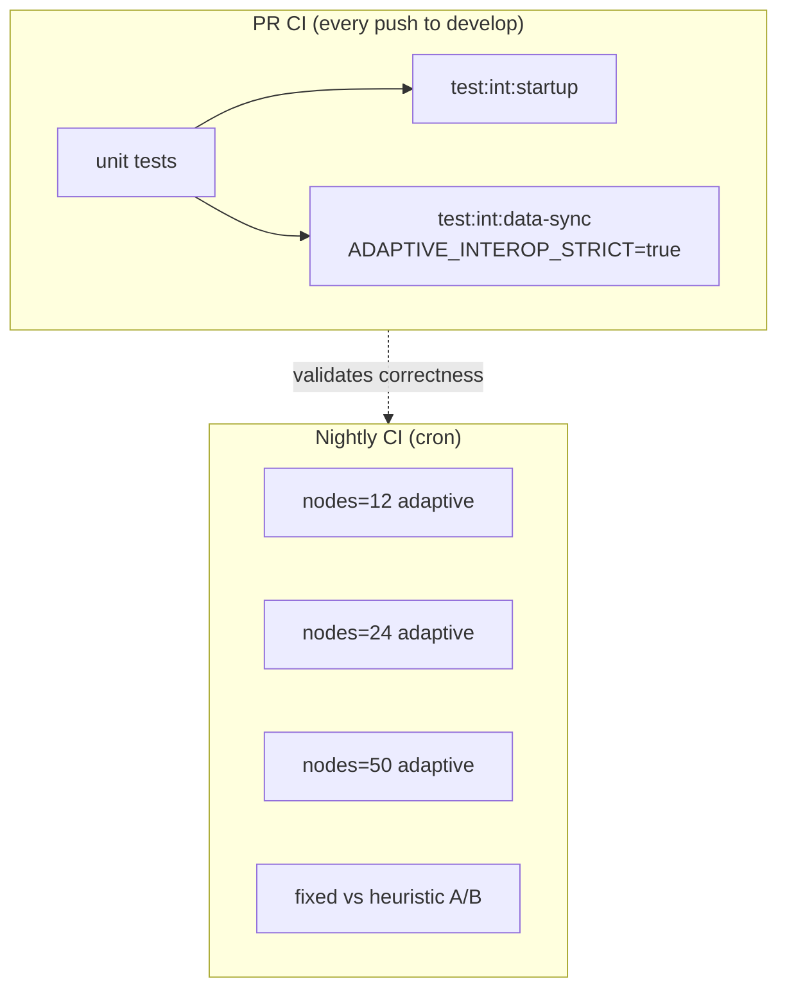

# Task: Tier 1 — Adaptive Anti-Entropy Interop Hardening

**Backlog ref:** [BACKLOG.md § Task 5.1](../BACKLOG.md#task-51-tier-1--extend-in-process-interop-worker-thread-harness)  
**ADR ref:** [docs/adr/0003-adaptive-anti-entropy-scheduling.md](../docs/adr/0003-adaptive-anti-entropy-scheduling.md)  
**Prerequisite:** PR [#36](https://github.com/Ahmed-Abdul-Rahman/de-chat/pull/36) merged (adaptive scheduling + baseline adaptive interop test)  
**Blocks:** Bandit scheduler (Step 7 in `todo.md`) — implement **after** Tier 1 nightly CI is green  
**Status:** PR merge gate complete ([PR #37](https://github.com/Ahmed-Abdul-Rahman/de-chat/pull/37) CI green) — nightly soak pending after merge  
**Goal:** Increase confidence in adaptive anti-entropy at scale using the **existing worker-thread interop harness** — no Docker, no Testground.

---

## Executive summary

PR #36 shipped adaptive scheduling and a single adaptive late-joiner interop test. Tier 1 closes the observability and CI gaps so we can:

1. Stop guessing convergence with fixed sleeps (metric-based polling in CI).
2. Surface adaptive metrics in interop reports (not just console JSON on failure).
3. Run **fixed vs heuristic A/B** in-process and compare outcomes.
4. Exercise **12 / 24 / 50 nodes** on a nightly schedule without bloating PR CI time.

Tier 2 (Docker Compose) and the bandit scheduler stay out of scope until Tier 1 nightly runs pass reliably.

---

## Current state (post PR #36)

### What works

| Asset | Location | Notes |
|-------|----------|-------|
| Late-joiner convergence (fixed interval) | `simulateAntiEntropyConvergence` | Default 6 nodes, sleep-based wait |
| Late-joiner convergence (adaptive) | Same + `adaptive` in `WorkerDataConfig` | Test in `interOpTestRunner.dataSync.int.ts` |
| Strict polling hook | `ADAPTIVE_INTEROP_STRICT` env | Only affects late-joiner scenario today |
| Worker anti-entropy snapshot | `nodeWorkerData.ts` → `getStatistics` | `outboundAttempts`, `usefulSyncs`, `lastSyncHashes`, `idleSkips` |
| Dormant-room bench (no P2P) | `tests/perf/antiEntropyScheduler.bench.ts` | Unit-level scheduling A/B |
| PR CI | `.github/workflows/ci.yaml` | `test:int:data-sync`, 45 min timeout, 6 GB heap |

### Gaps to close

| Gap | Evidence | Tier 1 fix |
|-----|----------|------------|
| CI uses sleep, not strict poll | `ci.yaml` has no `ADAPTIVE_INTEROP_STRICT` | Set env on data-sync job |
| Reports omit anti-entropy | `interopTestReporter.ts` prints connections only | Extend `TestReport` + `printTestReport` |
| Incomplete snapshot | `AntiEntropyMetricsStore.snapshot()` has more fields than worker exports | Extend worker + types |
| `scheduledTicks` not counted | `recordScheduledTickStarted()` is a no-op stub | Implement counter in store |
| No `convergenceMs` | Not tracked anywhere in interop | Worker or orchestrator timing |
| No fixed vs heuristic interop A/B | Only separate unit bench | New scenario + nightly test |
| Scale not exercised | Default 6 nodes; no nightly matrix | `interop-scale-nightly.yml` |
| Split-brain / revival use sleeps only | `ANTI_ENTROPY_WAIT_MS` fixed delays | Generalized poll helpers |

### Timing budget (late-joiner, 6 nodes)

From `InterOpScenarios.ts` — understand before changing CI timeouts:

| Phase | Duration | Purpose |
|-------|----------|---------|
| `STABILIZE_MS` | 120 s | Producer mesh + GossipSub replication topic subscriptions |
| `REPLICATE_SETTLE_MS` | 30 s | Messages replicate across producers |
| `LATE_JOINER_CONNECT_MS` | 20 s | Late joiner dials mesh |
| `ANTI_ENTROPY_WAIT_MS` | `syncIntervalMs * 4 + 15s` = **75 s** (at 15s interval) | Sleep fallback |
| Strict poll timeout | 120 s | `pollLateJoinerConvergence` max wait |

**Worst-case wall time (strict):** ~120 + 30 + 20 + 120 ≈ **4.5 min** for adaptive test alone. Full `test:int:data-sync` suite has 6+ scenarios — keep PR CI at 45 min; monitor after enabling strict.

---

## Architecture (unchanged)

```
interOpTestRunner.*.int.ts          ← test entrypoints (node:test)
        │
        ▼
InterOpScenarios.ts                 ← choreography (delays, spawn order, polls)
        │
        ├── workerUtils.ts          ← createWorker, terminateWorkers
        │
        └── childThread/
              nodeWorkerData.js     ← real DeChat node per worker thread
```

**Constraint:** Production default `adaptive.enabled: false` must not change. All adaptive config is test-only via `WorkerDataConfig.adaptive`.

---

## Implementation plan

### Phase 1 — Metrics foundation (small production touch)

**Why first:** Worker snapshot and reports depend on store fields that do not exist yet.

#### 1.1 Implement `scheduledTickCount` in `AntiEntropyMetricsStore`

- File: `packages/core/src/data-convergence/scheduling/AntiEntropyMetricsStore.ts`
- Change `recordScheduledTickStarted()` from no-op to `this.scheduledTickCount++`
- Add `scheduledTicks: number` to `AntiEntropyMetricsSnapshot` and `snapshot()` return
- Unit test: `AntiEntropyManager` or store unit test asserts tick count increments on `performScheduledSync` entry (including idle skips)

#### 1.2 Export additional snapshot fields to interop (no new store logic)

Already in `snapshot()` — wire through worker only:

| Field | Source | Interop name |
|-------|--------|--------------|
| `skipCounts.floor_sync_forced` | store | `floorSyncForces` |
| `skipCounts.mutex` | store | `mutexSkips` (optional, debug) |
| `consecutiveZeroHashComplete` | store | `zeroHashStreak` |
| `scheduledTicks` | store (new) | `scheduledTicks` |
| `stateVector[5]` | store | `activityScore` (optional shorthand) |

**Files:**

- `packages/core/tests/interop/types.ts` — extend `WorkerResult.antiEntropy`
- `packages/core/tests/interop/childThread/nodeWorkerData.ts` — map snapshot → result

#### 1.3 Track `convergenceMs` on late joiner

**Option A (recommended — worker-local):**

In `nodeWorkerData.ts`:

- On `set_expected_hashes` message: set `convergenceWatchStartedAt = Date.now()`
- In `getStatistics`: if `usefulSyncs > 0` and `convergenceWatchStartedAt` set, expose `convergenceMs = Date.now() - convergenceWatchStartedAt` (cap at poll window)
- Reset watch on message receipt

**Option B (orchestrator):** `pollLateJoinerConvergence` returns elapsed ms — less accurate (includes poll interval granularity).

Use **Option A** for per-node truth; orchestrator can also log wall-clock for A/B comparison.

---

### Phase 2 — Interop reporting

#### 2.1 Extend report types

File: `packages/core/tests/interop/types.ts`

```typescript
export type AntiEntropyInteropSummary = {
  readonly lateJoiner?: WorkerResult['antiEntropy'] & { readonly convergenceMs?: number };
  readonly producerIdleSkipsTotal: number;
  readonly producerOutboundAttemptsTotal: number;
  readonly producerFloorSyncForcesTotal: number;
};

export interface TestReport {
  // ...existing fields...
  readonly antiEntropy?: AntiEntropyInteropSummary;
  readonly scenarioWallMs?: number; // for A/B timing
}
```

#### 2.2 Add `summarizeAntiEntropyMetrics(workerResults)`

File: `packages/core/tests/interop/interopTestReporter.ts` (or new `antiEntropyInteropSummary.ts`)

- Identify late joiner: `hasTargetData !== undefined`
- Identify producers: everyone else with `dataSyncEnabled` context
- Aggregate producer `idleSkips`, `outboundAttempts`, `floorSyncForces`
- Return `AntiEntropyInteropSummary`

#### 2.3 Update `generateTestReport` / `printTestReport`

Print section when `antiEntropy` present:

```
--- Anti-Entropy Metrics ---
  Late joiner usefulSyncs: 2
  Late joiner convergenceMs: 34120
  Late joiner idleSkips: 0
  Producer idleSkips (total): 18
  Producer outboundAttempts (total): 45
  Producer floorSyncForces (total): 3
```

#### 2.4 Optional JSON artifact (nightly)

- Env: `INTEROP_WRITE_REPORT_JSON=true`
- Write: `packages/core/tests/interop/reports/<test-name>-<timestamp>.json`
- Add `reports/.gitkeep`; gitignore `reports/*.json` (artifacts uploaded from CI, not committed)

---

### Phase 3 — Strict polling in CI

#### 3.1 Generalize poll helpers

File: `packages/core/tests/interop/InterOpScenarios.ts` (or extract `interopPolling.ts`)

| Helper | Trigger | Success condition | Used by |
|--------|---------|-------------------|---------|
| `pollLateJoinerUsefulSync` | existing | `usefulSyncs > 0` | Late joiner (adaptive + fixed strict) |
| `pollWorkerTargetData` | new | `hasTargetData === true` | Split-brain, revival |
| `pollAllWorkersTargetData` | new | all workers `hasTargetData` | Split-brain union |

Shared implementation:

```typescript
const pollWorkerStats = async (
  workerRef: Worker,
  predicate: (stats: WorkerResult) => boolean,
  intervalMs: number,
  timeoutMs: number,
): Promise<{ converged: boolean; elapsedMs: number }>
```

- Return `converged: false` on timeout (test asserts separately — don't hang CI silently)
- Log warning on timeout with last snapshot

#### 3.2 Enable strict mode in PR CI

File: `.github/workflows/ci.yaml` — `integration-tests-data-sync` job:

```yaml
env:
  NODE_OPTIONS: "--max-old-space-size=6144"
  ADAPTIVE_INTEROP_STRICT: "true"
```

**Rollout:** Start with adaptive late-joiner only (already gated in scenario). After stable, extend strict polling to split-brain + revival in Phase 5.

#### 3.3 Apply strict polling to adaptive late-joiner (verify)

Existing code path at line ~327 in `InterOpScenarios.ts` — confirm:

- When strict + timeout without `usefulSyncs`, late-joiner test fails with metrics in log
- When strict + success, skip `ANTI_ENTROPY_WAIT_MS` sleep entirely

**Optional improvement:** Also poll `hasTargetData` (stronger than `usefulSyncs > 0` alone) — late joiner may have useful sync then still miss hashes. Change success predicate to:

```typescript
stats?.hasTargetData === true
```

---

### Phase 4 — Fixed vs heuristic A/B scenario

#### 4.1 Scenario design

**New export:** `simulateAntiEntropyConvergenceAbComparison(config)`  
Or two sequential calls from test — prefer **single orchestrator** that returns structured comparison:

```typescript
export type AbComparisonResult = {
  readonly fixed: AggregatedResult & { readonly wallMs: number };
  readonly heuristic: AggregatedResult & { readonly wallMs: number };
};
```

**Execution order:** Fixed first, then heuristic (same process, sequential — avoids port conflicts). Use distinct `networkId` suffixes: `benchnet-fixed-ab`, `benchnet-heuristic-ab` to prevent cross-talk if workers linger.

**Shared parameters:**

```typescript
const baseConfig = {
  testType: 'REPLICATION',
  replicationType: 'TOPIC_BASED',
  dataSyncEnabled: true,
  syncIntervalMs: 15_000,
  totalNodes: 6, // override via CLI for nightly
  // ...messageRate, pubsubTopic, etc.
};
```

| Run | `adaptive` |
|-----|------------|
| Fixed | `{ enabled: false }` |
| Heuristic | `{ enabled: true, scheduler: 'heuristic', minIntervalMs: 5_000, maxIntervalMs: 60_000 }` |

#### 4.2 Assertions (nightly test, not PR gate initially)

File: `interOpTestRunner.dataSync.int.ts`

```typescript
it('should A/B compare fixed vs heuristic anti-entropy convergence', { skip: !process.env.INTEROP_AB_TEST }, async () => { ... });
```

Or separate file: `interOpTestRunner.adaptiveAb.int.ts` included only in nightly workflow.

**Must pass (both runs):**

- Late joiner `hasTargetData === true`
- Late joiner `replicaCount >= maxProducerReplicaCount`
- Late joiner `usefulSyncs > 0`

**Heuristic-specific (soft → hard over time):**

- At least one producer: `idleSkips > 0` after late joiner converged (poll producers once more before terminate)
- Report `scenarioWallMs` for both — **do not fail** if heuristic slower initially; log ratio in report

**Comparison report section:**

```
--- A/B Comparison ---
  Fixed wallMs: 290000
  Heuristic wallMs: 275000
  Heuristic producer idleSkips: 24 vs Fixed: 0
  Heuristic producer outboundAttempts: 12 vs Fixed: 28
```

#### 4.3 Dormant-phase idle skip assertion

After late joiner converges, wait `maxIntervalMs / 2` (or 30s min), poll all producers:

- Heuristic: expect `sum(idleSkips) >= 1`
- Fixed: expect `sum(idleSkips) === 0` (or undefined)

This validates the adaptive policy in a **live P2P** setting, not just the bench simulation.

---

### Phase 5 — Strict polling for split-brain and revival

#### 5.1 Split-brain (`simulateSplitBrainConvergence`)

Replace final `await delay(ANTI_ENTROPY_WAIT_MS)` when `ADAPTIVE_INTEROP_STRICT`:

```typescript
if (ADAPTIVE_INTEROP_STRICT) {
  await pollAllWorkersTargetData(workers, 180_000);
} else {
  await delay(ANTI_ENTROPY_WAIT_MS);
}
```

Timeout: 180s (heal + sync takes longer than late-joiner).

#### 5.2 Offline revival (`simulateOfflinePeerRevivalConvergence`)

Replace final sleep with `pollWorkerTargetData(revivedWorker, 180_000)`.

#### 5.3 PR CI scope decision

| Scenario | Strict in PR CI? | Recommendation |
|----------|------------------|----------------|
| Late joiner (adaptive) | Yes | Phase 3 |
| Late joiner (fixed) | Optional | Keep sleep for now (less critical) |
| Split-brain | Phase 5b | Enable after 1 week green nightly |
| Revival | Phase 5b | Enable after 1 week green nightly |

---

### Phase 6 — Nightly scale workflow

#### 6.1 New workflow file

`.github/workflows/interop-scale-nightly.yml`

```yaml
on:
  schedule:
    - cron: '0 3 * * *'  # 03:00 UTC daily
  workflow_dispatch:

jobs:
  adaptive-scale-matrix:
    runs-on: ubuntu-latest
    timeout-minutes: 90
    strategy:
      fail-fast: false
      matrix:
        nodes: [12, 24, 50]
    steps:
      # checkout, node, yarn install, yarn build (same as ci.yaml)
      - name: Adaptive late-joiner scale run
        env:
          NODE_OPTIONS: "--max-old-space-size=6144"
          ADAPTIVE_INTEROP_STRICT: "true"
          INTEROP_WRITE_REPORT_JSON: "true"
        run: |
          yarn workspace @dechat/core test:int:data-sync -- \
            --test-name-pattern "adaptive heuristic" \
            --nodes ${{ matrix.nodes }}

      - name: Upload interop report
        uses: actions/upload-artifact@v4
        if: always()
        with:
          name: interop-report-nodes-${{ matrix.nodes }}
          path: packages/core/tests/interop/reports/

  adaptive-ab-nightly:
    runs-on: ubuntu-latest
    timeout-minutes: 60
    steps:
      # ... build ...
      - name: Fixed vs heuristic A/B
        env:
          NODE_OPTIONS: "--max-old-space-size=6144"
          ADAPTIVE_INTEROP_STRICT: "true"
          INTEROP_AB_TEST: "true"
          INTEROP_WRITE_REPORT_JSON: "true"
        run: yarn workspace @dechat/core test:int:adaptive-ab  # new script
```

**Note:** `node:test` filter syntax may need adjustment — verify how `readInteropCliArgs` parses `--nodes`. May require dedicated entry script `interOpTestRunner.adaptiveScale.int.ts` that only runs adaptive + A/B tests.

#### 6.2 New package.json scripts

```json
"test:int:adaptive-ab": "NODE_ENV=perf LOG_LEVEL=INFO node --trace-warnings dist/tests/interop/interOpTestRunner.adaptiveAb.int.js",
"test:int:adaptive-scale": "NODE_ENV=perf LOG_LEVEL=INFO node --trace-warnings dist/tests/interop/interOpTestRunner.adaptiveScale.int.js"
```

Keep `test:int:data-sync` unchanged for PR CI (full suite).

#### 6.3 Scale timing estimates

| Nodes | STABILIZE risk | Suggested timeout |
|-------|----------------|-------------------|
| 12 | Low | 45 min job |
| 24 | Medium — mesh formation | 60 min job |
| 50 | High — GossipSub subscribe pressure | 90 min job; may need `STABILIZE_MS` scale factor |

**Future optimization (not Phase 6 v1):** `STABILIZE_MS = base + (totalNodes - 6) * 5000` — only if 50-node flakes.

---

### Phase 7 — Documentation

Create `packages/core/tests/interop/README.md`:

- Env vars table (`ADAPTIVE_INTEROP_STRICT`, `INTEROP_AB_TEST`, `INTEROP_WRITE_REPORT_JSON`)
- Local commands (build-first rule)
- PR CI vs nightly CI scope
- How to read anti-entropy report section
- Troubleshooting flakes (mesh not formed → increase stabilize; worker leak → check terminate)

---

## File change matrix

| File | Phase | Action |
|------|-------|--------|
| `AntiEntropyMetricsStore.ts` | 1 | `scheduledTickCount` |
| `AntiEntropyMetricsStore.unit.test.ts` or manager test | 1 | Tick count assertion |
| `tests/interop/types.ts` | 1–2 | Extended `antiEntropy`, `TestReport` |
| `tests/interop/childThread/nodeWorkerData.ts` | 1 | Snapshot + `convergenceMs` |
| `tests/interop/interopTestReporter.ts` | 2 | Summary + print |
| `tests/interop/interopPolling.ts` | 3 | **New** — shared poll helpers |
| `tests/interop/InterOpScenarios.ts` | 3–5 | Use polls; A/B orchestrator |
| `tests/interop/interOpTestRunner.dataSync.int.ts` | 3 | Pass anti-entropy summary to report |
| `tests/interop/interOpTestRunner.adaptiveAb.int.ts` | 4 | **New** — A/B test only |
| `tests/interop/interOpTestRunner.adaptiveScale.int.ts` | 6 | **New** — adaptive tests only |
| `.github/workflows/ci.yaml` | 3 | `ADAPTIVE_INTEROP_STRICT=true` |
| `.github/workflows/interop-scale-nightly.yml` | 6 | **New** |
| `packages/core/package.json` | 6 | New scripts |
| `tests/interop/README.md` | 7 | **New** |
| `tests/interop/reports/.gitkeep` | 2 | **New** |
| `.gitignore` | 2 | `packages/core/tests/interop/reports/*.json` |
| `BACKLOG.md` | — | Link to this doc |
| `tasks/todo.md` | — | Link to this doc |

---

## CI strategy summary



| Gate | Runs | Strict poll | A/B | Max nodes |
|------|------|-------------|-----|-----------|
| PR | Full data-sync suite | Yes (late joiner adaptive) | No | 6 |
| Nightly | Adaptive + A/B only | Yes | Yes | 12, 24, 50 |

---

## Acceptance criteria

### PR merge gate (Tier 1 complete for PR)

- [x] `yarn workspace @dechat/core test` — all unit tests pass (CI #37)
- [x] `yarn build && yarn test:int:data-sync` with `ADAPTIVE_INTEROP_STRICT=true` — green (CI #37, ~31m)
- [x] Adaptive late-joiner report prints anti-entropy section with `usefulSyncs`, `convergenceMs`, `idleSkips`
- [x] `scheduledTicks` increments in store (unit tested)
- [x] No change to `adaptive.enabled` default in `config/defaults.ts`

### Nightly gate (Tier 1 fully complete)

- [ ] `interop-scale-nightly.yml` green for matrix 12 / 24 / 50 (runs after merge to `develop`)
- [ ] A/B test: both modes converge; heuristic `producerIdleSkipsTotal >= 1`
- [ ] JSON artifacts uploaded; no worker-thread hang (all workers terminate)
- [ ] 7 consecutive nightly greens before starting bandit scheduler work

---

## Risks and mitigations

| Risk | Likelihood | Mitigation |
|------|------------|------------|
| Strict poll flakes on slow CI | Medium | 120s timeout; log last snapshot; keep sleep fallback env off in CI only after soak |
| 50-node mesh never forms | High | Nightly only; start with 12; scale STABILIZE_MS if needed |
| A/B doubles wall time | Low (nightly only) | Separate workflow job, not in PR |
| `usefulSyncs > 0` but `hasTargetData false` | Low | Poll on `hasTargetData` as primary success signal |
| Worker leak on timeout | Medium | `terminateWorkers` in `finally`; existing interop teardown rules |
| `recordScheduledTickStarted` behavior change | Low | Counter only; no scheduling logic change |

---

## Out of scope (Tier 1)

- Docker Compose interop (Tier 2 — `tasks/tier2-compose-interop.md` TBD)
- Bandit scheduler implementation
- Testground
- Changing production adaptive defaults
- Cross-version libp2p interop
- Dynamic `STABILIZE_MS` formula (defer unless 50-node flakes)

---

## Implementation checklist (execution order)

Use this as the PR sequence — one or more PRs per phase is fine.

### PR 1 — Metrics + reporting (Phases 1–2)

- [x] 1.1 `scheduledTickCount` in store + unit test
- [x] 1.2 Extended `WorkerResult.antiEntropy` + worker snapshot mapping
- [x] 1.3 `convergenceMs` on late joiner (`set_expected_hashes` watch)
- [x] 2.1–2.3 `summarizeAntiEntropyMetrics` + report printing
- [x] 2.4 JSON artifact + `.gitkeep` + gitignore
- [x] Verify: unit tests + `test:int:data-sync` (CI #37)

### PR 2 — Strict CI polling (Phase 3)

- [x] 3.1 Extract `interopPolling.ts`
- [x] 3.2 Change poll success to `hasTargetData === true`
- [x] 3.3 `ADAPTIVE_INTEROP_STRICT=true` in `ci.yaml`
- [x] Verify: full data-sync CI green

### PR 3 — A/B + extended scenarios (Phases 4–5)

- [x] 4.1 `simulateAntiEntropyConvergenceAbComparison`
- [x] 4.2 `interOpTestRunner.adaptiveAb.int.ts` + package script
- [x] 4.3 Dormant-phase producer idle skip assertion
- [x] 5.1–5.2 Strict poll for split-brain + revival
- [ ] Verify: local/nightly A/B run with `INTEROP_AB_TEST=true` (post-merge nightly)

### PR 4 — Nightly CI + docs (Phases 6–7)

- [x] 6.1 `interop-scale-nightly.yml`
- [x] 6.2 `interOpTestRunner.adaptiveScale.int.ts`
- [x] 7.1 `tests/interop/README.md`
- [x] Update `BACKLOG.md` Task 5.1 status
- [ ] Soak: monitor 7 nightly runs (after merge)

---

## Approval

**PR merge gate approved** — [PR #37](https://github.com/Ahmed-Abdul-Rahman/de-chat/pull/37) CI green (unit + startup + data-sync interop).

**Remaining:** merge to `develop`, then complete nightly gate (7 consecutive greens) before bandit scheduler (Step 7).
